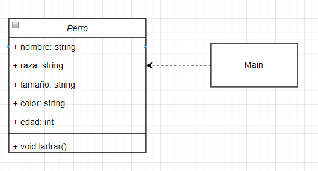

# Características iniciales
Este proyecto presenta un ejemplo de creación de una clase en C++ considerando los pasos que requiere elaborar una clase en este programa:
* Definir la clase. A partir del diseño en el que todos los atributos son públicos. 
  

* Declarar la clase. Hacer el .h, incluir las librerías asociadas
* Definir los métodos. Asociar los métodos declarados en el .h con su implementación concreta en un .cpp
* Crear objetos. Asignar memoria en tiempo de ejecución, inicializar atributos y métodos
* Acceder a los datos y métodos. Usando el operador punto (.) pues todas las variables son copias. 

## Como usarlo
* Compile el proyecto
* Ejecútelo verfique que en consola aparezca el mensaje
"Hello, World! Que ladre Guau guau"

